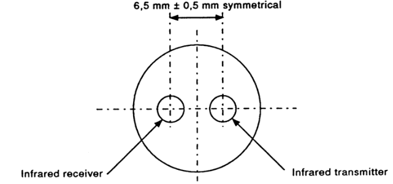
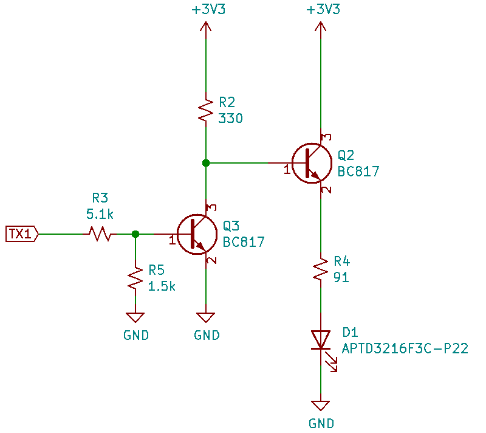
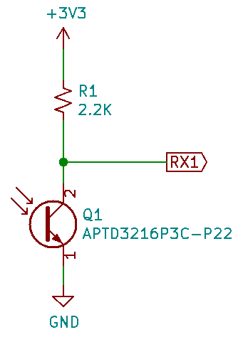
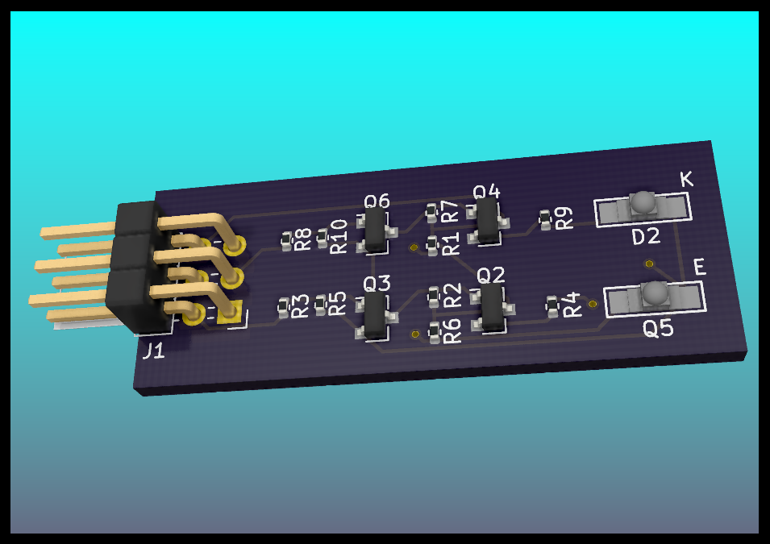

# Purpose
The purpose for the Optopod is to allow a Raspberry Pi or other small microcontroller to communicate with a meter using either the ANSI C12.18 or IEC 62056-21 communications standard.  Both standards use a very simple infrared (IR) optical communications protocol and the physical attributes of the port are nearly identical.  In particular, there are only two significant differences:  the IEC protocol has the transmit on the right and receive on the left with a round port, while the ANSI protocol has the transmit on the left and receive on the right with a flat at the bottom of the otherwise round port.  The IEC version is shown in Figure 1.

In addition to simply operating as a probe, the circuit will also have an intercept feature.  That is, it is intended to be able to put the circuit between an optical probe attached to a computer and a meter.  This will allow the Raspberry Pi to "listen in" to the communications between programming and/or reading software and the meter, allowing the circuit to be used to capture that communications for later analysis and/or alter it on the fly.

# Design overview
The board is intended to be driven from a 3.3V power supply and communications.  The serial RX and TX lines of a Raspberry Pi will be used to receive/transmit via the optical port circuits on opposite sides of the board.  A six-pin connector will be used for +3.3V, GND, RX1, TX1, RX2 and TX2 lines.   To make the assembly as simple as possible, only the IR LED and IR phototransistor will be on the opposite side of the board.  All other parts will be on the front of the board, allowing reflow soldering of all but those two parts.

### Board design
As mentioned earlier, the board actually has two separate transmit circuits and two separate receive circuits so that the board may be used *between* an optical probe and meter to allow it to "listen in" on the conversation between, say, proprietary programming software and a meter.  For simplicity in manufacturing all of the surface mount parts are mounted on the front except for one of the IR diode/phototransistor pairs, designated D1 and Q1 on the schematic.  The bill of materials is in Table 3 and the rendered version of the final board is shown in Figure 4.

 Item| Qty | Reference(s)  |    Value                                 | Price  |Ext Total
-----|-----|---------------|------------------------------------------|--------|----------
 1   | 2   |D1, D2         |IR LED Kingbright APTD3216F3C-P22         |$0.147  |$0.29
 2   | 1   |J1             |right angle 6pos hdr, 2.54mm              |$0.105  |$0.11
 3   | 2   |Q1, Q5         |IR phototrans Kingbright APTD3216P3C-P22  |$0.140  |$0.28
 4   | 4   |Q2, Q3, Q4, Q6 |TRANS NPN 45V 0.5A SOT23, BC817-40        |$0.049  |$0.20
 5   | 2   |R1, R6         |0402 SMD resistor 2.2K                    |$0.019  |$0.04
 6   | 2   |R2, R7         |0402 SMD resistor 330                     |$0.019  |$0.04
 7   | 2   |R3, R8         |0402 SMD resistor 5.1K                    |$0.019  |$0.04
 8   | 2   |R4, R9         |0402 SMD resistor 91                      |$0.019  |$0.04
 9   | 2   |R5, R10        |0402 SMD resistor 1.5K                    |$0.019  |$0.04
 10  | 1   |board          |Custom PCB                                |$1.550  |$1.55
     |     |               | **TOTAL**                                |        |**$2.62**

Table: Bill of materials

