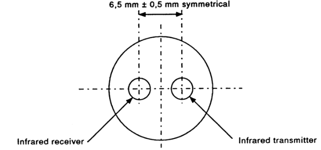

% Optical Port Design
% E. Beroset
% 28 February 2021

# Purpose
The purpose for the optical port circuit is to allow a Raspberry Pi or other small microcontroller to communicate with a meter using either the ANSI C12.18 or IEC 62056-21 communications standard.  Both standards use a very simple infrared (IR) optical communications protocol and the physical attributes of the port are nearly identical.  In particular, there are only two significant differences:  the IEC protocol has the transmit on the right and receive on the left with a round port, while the ANSI protocol has the transmit on the left and receive on the right with a flat at the bottom of the otherwise round port.  The IEC version is shown in Figure 1.

In addition to simply operating as a probe, the circuit will also have an intercept feature.  That is, it is intended to be able to put the circuit between an optical probe attached to a computer and a meter.  This will allow the Raspberry Pi to "listen in" to the communications between programming and/or reading software and the meter, allowing the circuit to be used to capture that communications for later analysis and/or alter it on the fly.

# Design overview
The board is intended to be driven from a 3.3V power supply and communications.  The serial RX and TX lines of a Raspberry Pi will be used to receive/transmit via the optical port circuits on opposite sides of the board.  A six-pin connector will be used for +3.3V, GND, RX1, TX1, RX2 and TX2 lines.   To make the assembly as simple as possible, only the IR LED and IR phototransistor will be on the opposite side of the board.  All other parts will be on the front of the board, allowing reflow soldering of all but those two parts.

## Optical specification
The optical specifications are derived from both the the IEC and ANSI standards.  The wavelength is specified as from 800 nm to 1000 nm, which is quite wide, while most IR diodes and phototransistors have a narrow peak.  In doing some research into currently commercially available probes and meters, it appears that 880 nm is widely used and is conveniently near the middle of the specified range, so this design uses 880 nm devices.

### Transmitter characteristics

The transmit power is specified for a 5 mm diameter spot directly in front of the transmitter and at 10 mm and 25 mm distances for both on and off conditions.  The numbers are slightly different for the ANSI and IEC versions of the specification as shown in Table 1.

+---------+--------------------+----------------------+-----------------------+--------------------+
|distance | IEC ON power       | IEC OFF power        | ANSI ON power         | ANSI OFF power     | 
|(mm)     | ($\text{mW/cm}^3$) | ($\text{mW/cm}^3$)   | ($\text{mW/cm}^3$)    | ($\text{mW/cm}^3$) |
+=========+====================+======================+=======================+====================+
|10       | $0.5 \le x \le 5$  | $x \le 0.01$         |  $1 < x < 7.5$        |    $x < 0.01$      |
+---------+--------------------+----------------------+-----------------------+--------------------+
|25       | no spec            |  no spec             |  $1 < x < 7.5$        |    $x < 0.01$      |
+---------+--------------------+----------------------+-----------------------+--------------------+

Table: Optical specifications for transmitter

Because these measurements are in $\text{mW/cm}^2$, but output specifications for IR LEDs is typically in mW/sr we need to convert.  Because we have the dimension of the test setup from the standards as mentioned above, we can calculate the size of the target in steradians by dividing the area of the target by the distance to it:

$$ \text{sr} = \frac{A_{\text{target}}}{d} = \frac{\pi r^2}{d} $$ 

So for the two distances specified in the ANSI standard we have 

$$ \frac{\pi (2.5\text{mm})^2}{10\text{mm}} = 1.963 \text{sr} $$

$$ \frac{\pi (2.5\text{mm})^2}{25\text{mm}} = 0.785 \text{sr} $$

To convert from the specified values in $\text{mW/cm}^3$ to mW/sr, we simply divide the power values by these two calculated steradians values.

+---------+---------------------+----------------------+-----------------------+--------------------+
|distance | IEC ON power        | IEC OFF power        | ANSI ON power         | ANSI OFF power     | 
|(mm)     | (mW/sr)             | (mW/sr)              | (mW/sr)               | (mW/sr)            |
+=========+=====================+======================+=======================+====================+
|10       |$0.25 \le x\le 2.5$  | $x \le 0.005$        |  $0.5 < x < 3.82$     |    $x < 0.005$     |
+---------+---------------------+----------------------+-----------------------+--------------------+
|25       | no spec             |  no spec             |$1.27 < x < 9.55$      |    $x < 0.0127$    |
+---------+---------------------+----------------------+-----------------------+--------------------+

Table: Desired optical characteristics for transmitter

Given these different values, an IR LED with a power specification of from 1.27 to 2.5 mW/sr should work and meet all specifications.  This is easily met by the Kingbright APTD3216SF4C-P22 GaAlAs LED which is specified to have an output power at least 1.6 mW/sr and a typical value of 4 mW/sr at 20mA.  This particular IR LED has a 40 degree viewing angle, so should easily be able to illuminate the corresponding receiver.  Because the output power is proportional to the current, we will have to drive the part with a maximum of 20 mA to meet the specification.  Since few microprocessor pins can sink that much current, we can use a simple common emitter transistor to boost the current and to invert the sense (ON means zero for both ANSI and IEC specifications).  The BC817-40 in a SOT23 package should work nicely for this purpose.  For this transistor, $V_{CE(SAT)} = 0.024\text{V} @ I_C = 20\text{mA}$, and because the forward voltage of the diode is typically 1.3V (and max 1.6V), we can calculate the load resistor $(3.3 - 1.3 - 0.024)\text{V}/20\text{mA} = 98.8\Omega$, so we can use the closest standard value, $100\Omega$.  

For the voltage divider to bias the base, given a 20 mA $I_C$, we can estimate $I_B = I_C/h_{FE} = 20\text{mA}/250 = 80 \mu\text{A}$.  For a single base resistor, and estimating $V_{BE} = 0.7$V, we can calculate $R = (V_\text{in} -V_{BE})/I_B = (3.3 - 0.7)\text{V}/80\mu\text{A} = 32.5K\Omega$.

### Receiver characteristics
The receiver characteristics mirror the transmitter characteristics in that instead of the on and off producing a particular light output, the light input values are specified to produce either on or off as outputs.  The Kingbright APTD3216P3C-P22 phototransistor has the same size package and lens as the IR LED mentioned above and appears to meet all of the characteristics needed, although its peak sensitivity is a bit higher, at a wavelength of 940 nm.  Because the receiver sensitivity is broader than the transmitter sensitivity, this does not cause a problem; the sensitivity at 880 nm is around 95% of the sensitivity at 940 nm.
